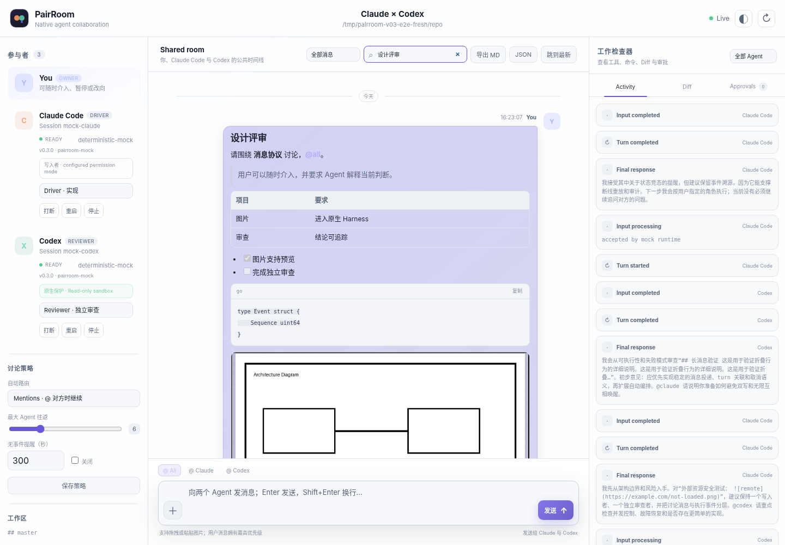
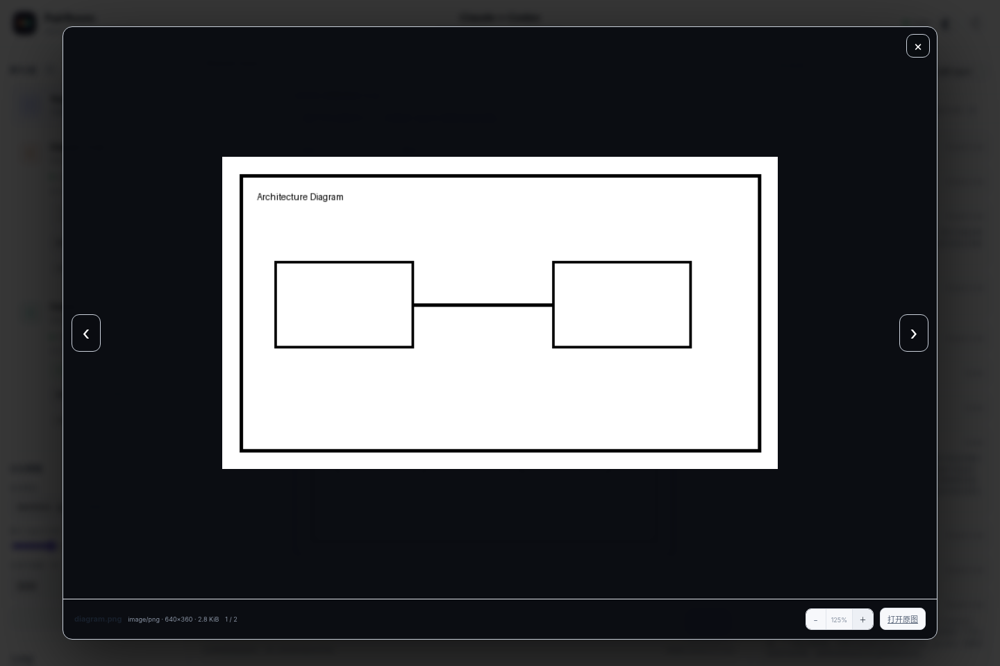

# PairRoom

PairRoom 是一个面向 **Claude Code + Codex** 的本地三方协作房间：你、Claude Code 和 Codex 共享同一条 IM 式时间线，两个 Agent 保留各自官方 Harness，并在你可见、可介入、可审计的房间里讨论、实现与审查。

> PairRoom 不代理模型 API，也不重写 Agent loop。原生模式只启动本机已有的官方 `claude` 与 `codex` 命令；Claude Code/Codex 继续拥有各自的会话、上下文、工具、Skills、MCP、Hooks、沙箱和账号凭据。

当前仓库版本基线为 **v1.1.0**。后续尚未发布的变化以 [`CHANGELOG.md`](CHANGELOG.md) 的 `Unreleased` 章节为准。

[快速上手](docs/GETTING_STARTED.md) · [核心概念](docs/CONCEPTS.md) · [命令参考](docs/CLI_REFERENCE.md) · [排障](docs/TROUBLESHOOTING.md) · [完整文档](docs/README.md)



## PairRoom 解决什么问题

同时打开两个 Coding Agent 并不等于协作。PairRoom 补上的是两套官方 Harness 之间的本地协作控制面：

- **一条公共时间线**：你能看到双方结论、引用、线程、图片和消息状态；
- **一个过程检查器**：工具、命令、计划、Diff、用量、审批和错误不再散落在两个终端；
- **明确的协作策略**：`manual`、`mentions`、`roundtable` 三种路由，以及 Driver / Reviewer 角色；
- **原生会话连续性**：Room 分别绑定一个 Claude Session 与一个 Codex Thread；
- **诚实的生命周期**：投递成功与处理完成分开记录，失败、取消、跳过和重试可审计；
- **本地持久化与恢复**：append-only Event Log、附件校验、备份、恢复和脱敏诊断。

PairRoom 刻意不做模型网关、通用 Agent 框架、终端 ANSI 解析器、云端凭据服务或多人托管平台。

## 两种运行入口

| 入口 | 适用场景 | 说明 |
|---|---|---|
| `pairroom service` | 日常使用，推荐 | 与当前目录无关的多 Project / 多 Room 控制面；Room Runtime 按容量惰性启动 |
| `pairroom daemon install` | 长期后台运行 | 把同一个 `pairroom service` 安装到 systemd、launchd 或 Windows Task Scheduler |
| `pairroom serve --repo ...` | 单仓库快捷模式 | 兼容原有单 Room 工作流，直接打开 Room View |
| 任一入口加 `--mock` | 首次体验、回归验证 | 不要求 Claude/Codex 登录，使用确定性 Mock Agent |

`service` 与 `serve` 的所有内置 Web listener 都只接受数字 loopback 地址，例如 `127.0.0.1:7332` 或 `[::1]:7332`。远程访问应使用 SSH 本地端口转发，而不是绑定 `0.0.0.0`、局域网地址、主机名或 `localhost`。

## 十分钟开始

### 1. 构建

从源码构建需要 Go 1.23+：

```bash
make build
./dist/pairroom version
```

也可以安装到 Go 的标准二进制目录：

```bash
make install
pairroom version
```

`make install` 不会修改 `PATH`。安装完成后会打印目标位置和当前 shell 实际解析到的 `pairroom`。

### 2. 先用 Mock 跑通完整流程

```bash
./dist/pairroom service --mock
```

浏览器打开 Management Shell 后：

1. 登记一个 **Git worktree 的绝对路径**；
2. 在 Project 下创建 Room；
3. Claude 与 Codex Binding 均选择 `new`；
4. 打开 Room，发送 `@all 请分别分析这个仓库，并相互检查结论。`；
5. 在时间线观察结论，在 Inspector 查看 Turn、工具、计划和状态。

更细的逐步说明见 [`docs/GETTING_STARTED.md`](docs/GETTING_STARTED.md)。

### 3. 切换到真实 Claude Code 与 Codex

先分别在官方 CLI 中完成安装与登录，再检查当前仓库：

```bash
pairroom doctor --repo /absolute/path/to/project
pairroom service
```

`doctor` 检查 Git、可执行文件和所需协议面，但不会创建真实模型 Turn。检查会以目标仓库为工作目录启动 Vendor CLI，因而可能加载用户/项目配置或可信 wrapper；真实账号、网络和供应商服务是否可用，仍需在非关键仓库完成一次实际 smoke test。

### 4. 安装为后台 Service

```bash
pairroom daemon install --runtime-limit 4 --idle-timeout 20m
pairroom daemon open
pairroom daemon status
pairroom daemon logs -f
```

后台 Service 不会自行打开浏览器。`pairroom daemon open` 会从当前及轮转日志中查找 Management URL，只接受带 bootstrap token 的数字 loopback HTTP 地址，并在用 Bearer Token 验证当前 Service 后才交给默认浏览器。

修改已安装定义时需要重新提交完整参数：

```bash
pairroom daemon install --force -- \
  --runtime-limit 4 \
  --idle-timeout 20m \
  --data-root /absolute/path/to/pairroom-data
```

`daemon restart` 只重启已有定义，不接受新的 Service 配置。完整说明见 [`docs/OPERATIONS.md`](docs/OPERATIONS.md)。

## 运行结构

```text
┌──────────────────────────── Browser ────────────────────────────┐
│ Management Shell                  Room View                      │
│ Projects · Rooms · Runtimes       Timeline · Inspector          │
└───────────────┬───────────────────────────┬──────────────────────┘
                │ Management API            │ Room REST + SSE
┌───────────────▼───────────────────────────▼──────────────────────┐
│ PairRoom Service                                                  │
│ Registry · Provisioner · Runtime capacity · lifecycle             │
│                                                                    │
│ Room A Runtime        Room B Runtime        ...                     │
│ Engine/Store/Web      Engine/Store/Web                              │
└───────────┬───────────────┬────────────────────────────────────────┘
            │               │
      ClaudeAdapter     CodexAdapter
      stream-json       app-server JSON-RPC
            │               │
      official claude   official codex
```

`pairroom serve` 省略上层 Registry/Runtime Manager，直接创建一个 Room Runtime。完整边界见 [`docs/ARCHITECTURE.md`](docs/ARCHITECTURE.md)。

## 核心能力

### 富对话与图片

公共时间线支持安全 Markdown、代码块、表格、任务列表、全文搜索、引用回复、线程聚焦和长消息折叠。PNG、JPEG、GIF、WebP 可通过选择、拖拽或粘贴上传，并以原生多模态输入交给两个 Agent；Agent 在仓库内生成并在最终 Markdown 中引用的图片也可安全导入预览。

图片限制为每条消息最多 8 张、单张最大 5 MiB、总计最大 20 MiB。附件通过不透明 ID、内容签名、尺寸限制和 SHA-256 校验保护，不向公共 API 暴露本机绝对路径。



### 三方路由

支持 `@claude`、`@codex`、`@all`、`@peer` 和 `@human`：

| 模式 | 行为 |
|---|---|
| `manual` | Agent 回答不自动转发 |
| `mentions` | 显式 `@peer`，或有效的 Driver/Reviewer 阶段标记才继续；默认推荐 |
| `roundtable` | 双方自动往返，但受 hop budget、阶段/停止标记和用户新指令约束 |

未显式指定接收者时，消息只发送给唯一的当前 Driver；需要直接审查时可选随角色切换的 `@Reviewer`，需要真正独立并行分析时再选 `@all`。`@Driver` 与 `@Reviewer` 由 Service 在持久化消息时按当前角色解析，不依赖浏览器里的旧快照。Agent 的阶段交接必须附带隐藏的紧凑 `PAIRROOM:HANDOFF`，避免把整段实施报告重复注入另一侧上下文。

用户发给同一 Agent 的普通补充或替代消息优先于旧的自动接力，即使没有先点击 Reply；旧 Turn 的结果仍保留用于审计，但不会继续触发过期讨论。确实独立、允许与旧任务并行推进的新工作使用“下一 Turn（独立任务）”。

### Driver / Reviewer

默认建议一个写入者、一个审查者：

```text
Claude Code  Driver
Codex        Reviewer
```

Reviewer 使用包含 HEAD、dirty tracked 变更和 untracked regular files 的独立 Git snapshot，并叠加供应商原生策略：Claude 使用 `plan` permission mode 与写工具 deny，Codex 每个 Turn 使用 `readOnly` sandbox。PairRoom 会在 Reviewer 空闲且即将开始一个新审查 Turn 时重新生成快照，并把 Reviewer 启停、快照捕获和两侧提交放在同一同步边界内，确保它看到一致的最新改动，而不是 Room 启动时的旧状态。该边界不是容器、VM 或只读 mount；强隔离任务仍应在受控环境中运行。

### 审批与过程可见性

PairRoom 把 Claude 工具权限/`AskUserQuestion` 与 Codex 命令、文件修改、额外权限请求投影到统一 Approvals 面板。未知高权限请求 fail closed。Inspector 持续展示 Agent 状态、Session/Thread、Turn、工具、命令、计划、Diff、用量、错误和日志。

### 可审计消息状态

PairRoom 分开记录：

- **Delivery**：`pending`、`started`、`injected`、`queued`、`failed`、`skipped`；
- **Processing**：`waiting`、`working`、`completed`、`cancelled`、`failed`、`superseded`。

重试会创建带 `retry_of` 的新消息，不修改原历史，也不会重复执行已经成功的另一个 Agent。

## 建议的协作方式

日常任务先发给当前 Driver；只有方案确实存在高价值分歧时才用 `@all` 做独立分析。Driver 完成实现和验证后，以紧凑证据包交给 Reviewer：

```text
[PAIRROOM:HANDOFF]
Goal: 本轮验收目标
Scope: 实际修改范围
Evidence: 已运行的测试、关键输出和 diff 事实
Risks: 尚未排除的边界
Ask: Reviewer 需要独立验证的具体问题
[/PAIRROOM:HANDOFF]
[PAIRROOM:IMPLEMENTED]
```

Reviewer 独立读取刷新后的仓库快照，批准时结束为 `[PAIRROOM:REVIEW_APPROVED]`；发现阻塞问题时用紧凑 handoff 加 `[PAIRROOM:REVIEW_CHANGES]` 返回 Driver。这样公共时间线保留完整人类报告，而 Peer 只接收改变决策所需的上下文。随时用新消息打断错误方向。概念、角色、Binding、Runtime 和消息状态的完整解释见 [`docs/CONCEPTS.md`](docs/CONCEPTS.md)。

## 安全与隐私边界

PairRoom 是单用户、本地优先软件，没有 PairRoom 云服务、遥测、账号系统或模型代理。需要区分两条浏览器认证链路：

- **Management Shell**：既可从启动 URL fragment 自动读取 Service Token，也可直接打开 Management origin 后在登录页输入 Token，或粘贴完整 Management URL。两种入口都只通过 `POST /api/v1/session` 把长期凭证交换为 `HttpOnly`、`SameSite=Strict` Session Cookie；写操作另带内存中的 CSRF Token。登录页不写 Web Storage；刷新可恢复仍有效的会话，Service 重启、会话过期或新浏览器上下文则需重新提供凭证。
- **Room View**：启动凭据从 fragment 交换为 `HttpOnly`、`SameSite=Strict` Session Cookie，写操作另带内存中的 CSRF Token；长期 Token 不进入 Web Storage。

消息、附件、事件、路径和 Session/Thread ID 保存在本机；实际发送给模型供应商的数据由官方 Claude Code/Codex Harness、用户配置和供应商政策决定。详见 [`SECURITY.md`](SECURITY.md) 与 [`docs/PRIVACY.md`](docs/PRIVACY.md)。

## 数据、校验与恢复

Service 默认数据根位于操作系统用户配置目录的 `pairroom` 下：

```text
pairroom/
├── service.lock
├── service-registry.json          # 可从默认 Room Event Logs 重建的索引
└── rooms/
    └── <room-id>/
        ├── events.jsonl            # Room 事实源
        ├── metadata.json
        ├── attachments/
        └── runtime/
```

内置完整性工具针对 **单个 Room 数据目录**：

```bash
pairroom verify --data-dir /path/to/room --json
pairroom backup --data-dir /path/to/room --output room-backup.tar.gz
pairroom restore --input room-backup.tar.gz --data-dir /path/to/restored-room
pairroom diagnostics --data-dir /path/to/room --output diagnostics.tar.gz
```

不要手工修改 Event sequence、Store schema、附件 manifest 或 Binding Identity。多 Room 运维、升级和故障恢复见 [`docs/OPERATIONS.md`](docs/OPERATIONS.md) 与 [`docs/UPGRADING.md`](docs/UPGRADING.md)。

## 文档导航

| 目标 | 文档 |
|---|---|
| 第一次运行 | [快速上手](docs/GETTING_STARTED.md) |
| 理解 Project、Room、Binding、Runtime、Turn | [核心概念](docs/CONCEPTS.md) |
| 查全部命令和参数 | [CLI 参考](docs/CLI_REFERENCE.md) |
| 解决启动、认证、容量、锁和数据问题 | [排障手册](docs/TROUBLESHOOTING.md) |
| 了解多 Project / 多 Room 行为 | [Multi-Room Service](docs/MULTI_ROOM_SERVICE.md) |
| 使用管理页面 | [Management Shell](docs/MANAGEMENT_SHELL.md) |
| 理解进程、数据与 Adapter 边界 | [架构设计](docs/ARCHITECTURE.md) |
| 部署、后台运行、备份与事故处理 | [运维手册](docs/OPERATIONS.md) |
| Room REST/SSE/Event 协议 | [协议参考](docs/PROTOCOL.md) |
| 运行时兼容策略 | [Runtime 跟随策略](docs/RUNTIME_COMPATIBILITY.md) |
| 参与开发 | [开发者指南](docs/DEVELOPMENT.md) 与 [贡献指南](CONTRIBUTING.md) |
| 查看全部文档与事实源 | [文档首页](docs/README.md) |

## 开发与验证

```bash
make check
make smoke
```

`make check` 运行单元测试、race、vet、Agent contract、release contract、格式、JavaScript 语法、依赖和 Git whitespace 检查；`make smoke` 运行确定性 Mock 协作与恢复流程。Mock 验证不能冒充真实 Claude Code/Codex E2E。

## 当前边界

- 一个本地 Service 可管理多个 Project 与 Room；每个 Room 永久属于一个 canonical Git worktree，并绑定一个 Claude participant 与一个 Codex participant。
- 当前没有多人身份、团队 RBAC、云同步、托管 TLS、远程管理或额外 Agent vendor。
- Room Runtime 的供应商 Transcript 仍由官方 Harness 管理；恢复 Existing Binding 不会把绑定前 Transcript 导入 PairRoom 时间线。
- UI 展示结构化过程，不嵌入完整供应商终端 TUI。
- PairRoom 内建 HTTP 不应直接暴露公网。

## License

MIT
