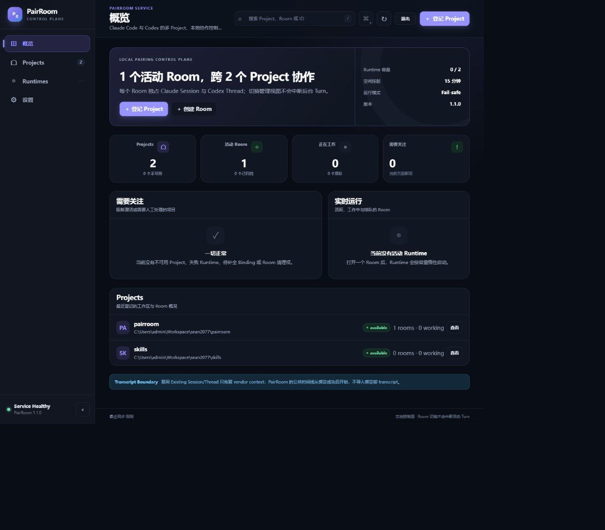

# PairRoom

PairRoom 是一个运行在本机的 Claude Code × Codex 协作控制面。它保留两个官方 CLI 的会话、工具、审批与沙箱能力，只负责把用户、两个 Agent 和项目工作区组织成可观察、可中断、可审计的协作过程。

## 核心模型

PairRoom 不让两个 Agent 像 IM 群聊一样并发互相唤醒。每个 Room 同一时刻只有一个 **native Turn owner**：

```text
user
  -> current Agent completes one native Turn
  -> reliable terminal boundary
  -> optional HANDOFF + NEXT
  -> next Room FIFO item
```

这不是机械的 A/B/A/B 消息轮换。当前 Agent 可以在一个 native Turn 内执行工具、更新计划并接受 steering；只有在可靠的 Turn 结束边界之后，另一个 Agent 才能开始。

关键性质：

- **Human authority**：用户可以指定目标 Agent、覆盖后续流程、审批、取消或停止；
- **Single owner**：两个 native runtime 不会同时拥有执行权；
- **Explicit handoff**：普通 `@peer` 文本不会投递，Agent 交棒必须同时给出 `HANDOFF` 与 `NEXT`；
- **Fail closed**：进程重启不自动重放内存 FIFO，避免重复执行有副作用的操作；
- **Native harness first**：PairRoom 不重写 Claude Code 或 Codex 的工具循环与权限模型。

## 快速体验

只验证 PairRoom 本身，不启动真实 Agent：

```bash
go run ./cmd/pairroom service --mock
```

Management Shell 打开后：

1. 注册一个本地 Git Project；
2. 创建 Room；
3. 选择 Driver / Reviewer；
4. 发送一个单 Agent 任务，或描述一个顺序工作流；
5. 在 Room View 中观察 Turn、工具活动、审批、投递与错误状态。

使用真实 runtime 前，先分别确认 `claude` 与 `codex` CLI 已安装、已登录，并能在目标仓库独立工作。完整步骤见 [Getting Started](docs/GETTING_STARTED.md)。

### 运行时预览

下面是 PairRoom Management Shell 的实际运行时界面：可以集中查看 Project、Room、Runtime 容量与健康状态，并从同一控制面进入协作 Room。



## 文档入口

- [文档地图](docs/README.md)
- [核心概念与接力语义](docs/CONCEPTS.md)
- [配置与 Provider](docs/CONFIGURATION.md)
- [CLI 参考](docs/CLI_REFERENCE.md)
- [架构与不变量](docs/ARCHITECTURE.md)
- [运维、备份与恢复](docs/OPERATIONS.md)
- [升级说明](docs/UPGRADING.md)
- [贡献指南](CONTRIBUTING.md)

## 开发验证

```bash
make docs-check
make check
make smoke
```

`docs-check` 会校验文档链接、源码路径、CLI 参数、HTTP 路由和 JSON 配置字段，防止文档在代码继续演进后静默漂移。

## 状态与边界

PairRoom 仍在快速演进。CLI、HTTP API、Event Log 和 Agent 协议的 breaking change 会记录在 [CHANGELOG](CHANGELOG.md) 与 [Upgrading](docs/UPGRADING.md)。当前 Mock E2E 可以验证调度、持久化和恢复链路，但不能替代真实 Claude Code / Codex native E2E。

## License

[MIT](LICENSE)
