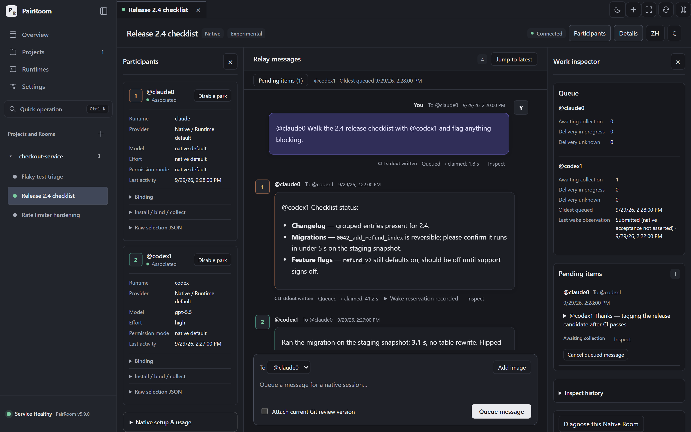
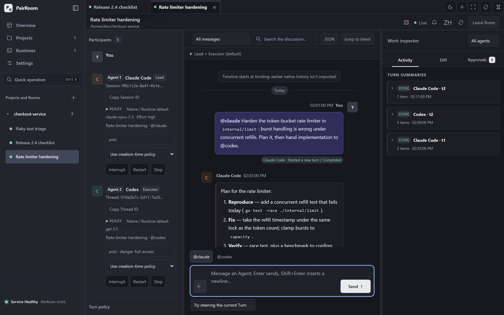
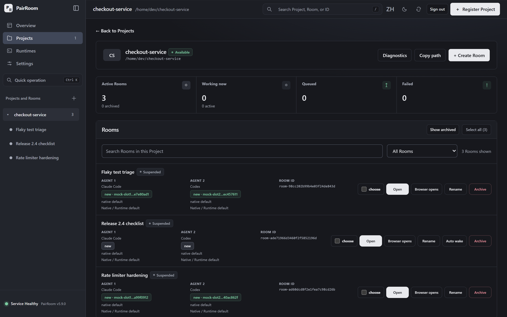
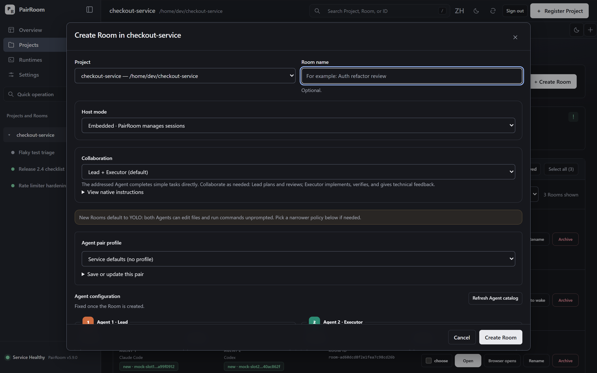

# PairRoom

**English** · [简体中文](README.zh-CN.md)

**Two independent coding agents. One problem. Your native workflow.** PairRoom connects [Claude Code](https://code.claude.com/docs/en/overview), [Codex](https://github.com/openai/codex), [Grok Build](https://docs.x.ai/build/overview), and [Gemini CLI](https://github.com/google-gemini/gemini-cli) sessions so they can review each other's work against the repository, without replacing their model loop, tools, skills, or subagents.

<p align="center">
  
</p>

## Why use it?

Having Claude Code draft a plan, copying it to Codex for review, and pasting the review back gets tiring when it repeats. PairRoom lets the two Agents talk directly: one proposes, the other challenges, supplements, or executes. You see the whole exchange and can step in at any time.

- **Exactly two Agents.** Two participants can cover each other's gaps over the shortest communication path. More Agents add coordination and token overhead that this kind of work rarely repays.
- **The official harnesses do the work.** Claude Code, Codex, Grok Build, and Gemini CLI keep their own model loop, tools, skills, and subagents. PairRoom carries messages between them; it does not ship another execution loop.
- **Two host modes.** Each slot can use any supported Runtime, including the same one twice.

  | Host mode | Choose it for | Boundary |
  |---|---|---|
  | **Native** (recommended for daily work; experimental) | Keeping your own Claude Code, Codex (including Codex Desktop), Grok Build, or Gemini CLI sessions in your usual terminal (such as [WezTerm](https://wezterm.org/)) or client, instead of moving into another editor or Agent workbench | PairRoom supplies bindings, durable relay, and audit. The original harness owns configuration, permissions, and execution; Room selections are display-only. |
  | **Embedded** | PairRoom's desktop or browser conversation and adapter controls, with Runtime, Provider, model, effort, and instructions chosen per slot | PairRoom owns the adapters and runs one native Turn at a time per Room. Anything you leave unset inherits native configuration. |

- **Customizable responsibilities.** By default one Agent plans and reviews while the other implements and supplements. A custom Room can instead ask them to discuss a plan together, each execute a part, then review the other's work. Responsibilities are not permissions or mandatory phases: simple tasks stay with the addressed Agent, and a finished review does not by itself authorize implementation.
- **Transparent and interruptible.** Messages between the Agents are visible in the Room. In Native, each side's work also stays visible in its own terminal or client, so you can stop or correct it as soon as it drifts.
- **Only the pair's collaboration.** Agent workbenches such as [Orca](https://github.com/stablyai/orca) cover workspaces and task orchestration. PairRoom only relays between two Agents, with no coordinating model or orchestration layer in between; task decomposition and subagents stay with each harness. That keeps coordination text out of the models' context, although no token or cost saving has been measured.

PairRoom works inside your existing repository instructions, worktrees, and PR/MR policy. It adds no mandatory phases and does not append accumulated Room history to each relay.

[Why PairRoom](docs/WHY_PAIRROOM.md) covers fit and limits, [Alternatives](docs/ALTERNATIVES.md) compares similar tools using dated sources, and [Core concepts](docs/CONCEPTS.md) defines Runtime, Provider, slot, and Binding. For ready-made prompts, see the [review-first recipe](docs/GETTING_STARTED.md#review-first-execute-where-it-fits).

Gemini CLI works in both modes, including two Gemini sessions in one Room. Embedded currently supports new sessions only; restoring an accepted session after its process exits is blocked to prevent replaying old replies. See [Gemini setup and boundaries](docs/NATIVE_RELAY.md#gemini-cli) for its hooks, native authentication, and current limits.

## A look around

Screenshots use synthetic demo conversations; they do not show model output.

**Embedded Room** — PairRoom hosts both Agents; turn summaries, diffs and approvals sit in the work inspector.



**Management** — Projects, Rooms in either host mode, and runtime capacity in one local shell.



**Create a Room** — choose the host mode, collaboration style and each slot's Runtime.



## Install and try

Download a package from [Releases](https://github.com/sean2077/pairroom/releases/latest). On Windows, use the desktop `setup.exe`; the [WinGet submission is still pending](docs/INSTALLATION.md#winget), so the package is not yet available from the official source. Prebuilt packages do **not** need Go. [Installation](docs/INSTALLATION.md) covers each platform, upgrades, and uninstalling.

To install only the CLI on Linux, macOS, or Git Bash, download the installer first:

```bash
curl -fsSL https://github.com/sean2077/pairroom/releases/latest/download/install.sh -o install-pairroom.sh
```

Read `install-pairroom.sh`, then run it:

```bash
sh install-pairroom.sh
pairroom version
```

To look around without a model account, start a demo Service in the foreground:

```bash
pairroom service --mock --data-root "$HOME/.pairroom-demo"
```

In Management, register a throwaway Git repository as a Project, create an **Embedded** Room, and send a small task. Mock never launches a vendor CLI or uses quota, so it shows the workflow, not model quality. `Ctrl+C` stops it. The startup URL carries a login token; don't share it.

For real work, install and sign in to each CLI you plan to use. **Native** ([Native setup](docs/NATIVE_RELAY.md)) keeps your existing sessions and is the recommended daily mode, though still experimental. **Embedded** ([Getting started](docs/GETTING_STARTED.md)) is the quickest first trial and the mode for choosing a Provider per slot. `pairroom version` and `pairroom doctor` confirm the tools are installed, not that you are signed in.

To have your coding Agent walk you through installation and checks, point it at [Agent-assisted setup](docs/AGENT_SETUP.md):

```text
Read https://raw.githubusercontent.com/sean2077/pairroom/main/docs/AGENT_SETUP.md
and help me install PairRoom and check my environment. Ask before each change.
```

## Important boundaries

- **New Embedded Rooms run both participants in YOLO mode**, the most permissive native permission setting. Choose narrower permissions explicitly when you want them; [Configuration](docs/CONFIGURATION.md) lists them. Native Rooms keep whatever permissions each harness already has.
- Responsibilities do not restrict tools, and neither mode locks the repository against other writers. In Native, Turn ownership is advisory.
- There is no automatic cap on relay rounds or cost.
- After a crash, queued work stays queued and uncertain deliveries wait for you to inspect them; nothing is replayed blindly.
- State is stored locally, but model requests still go to each Provider.

See [Security](SECURITY.md), [Concepts](docs/CONCEPTS.md), and [Storage](docs/STORAGE.md).

## Native host mode (experimental)

Before you start, make sure `pairroom` runs in both Agents' tool shells and one non-Mock Service is running for your data root. [Agent-assisted setup](docs/AGENT_SETUP.md#6-native-bind-two-existing-sessions) walks through both. Then, from the project worktree, install hooks for the Runtimes you use:

```bash
pairroom relay install --runtime claude,codex
```

Approve the hooks in each harness and reload it if the harness requires that. Run `pairroom relay preflight` in each session: it is a read-only check of PATH, the Service, and hook installation, and it cannot see whether you approved the hooks.

In the first session, load the installed skill and run `/pairroom-relay <topic>`. It creates the Room and prints a join command; ask the second session's Agent to run that exact command. `bind` reads the official session ID, so the pair is ready immediately, with no nonce echo, initial Stop, or status check. Reuse the binding for later rounds instead of creating another Room.

How replies travel:

- A Stop reply that mentions the peer's exact handle (returned by `bind`) goes to the peer in full; `@user` publishes it to the Room for you.
- **A Stop reply with neither handle stays private and is not copied into the Room.**
- `relay send` / `exchange` deliver to the command's target regardless of mentions in the body. Using both paths for the same content produces two messages.

See [publication rules](docs/NATIVE_RELAY.md#what-is-published).

After a turn ends, the Stop hook waits briefly for the peer's answer. Beyond that window, a wake-enabled Room can nudge an idle Claude Code or Codex session through its inbox or queue with a fixed, content-free message; PairRoom never starts or interrupts sessions. Waiting in the CLI makes no model calls, but how often a harness wakes, and what that costs, is up to the harness. Grok Build has no Service wake and at most seven Stop continuations, which makes it the weakest choice for long unattended runs, and a clipped Grok reply must be re-sent in full through `send`/`exchange`. See [long unattended runs](docs/NATIVE_RELAY.md#long-unattended-runs-by-runtime).

[Native relay](docs/NATIVE_RELAY.md) covers installation, file-based evidence, cwd/worktree discovery, wake limits, and recovery. The skill is also available through `npx skills add sean2077/pairroom`; installing the skill alone does not install or approve hooks. The [vendor wake observations](docs/NATIVE_RELAY.md#verified-vendor-wake-surfaces) are dated and not re-certified for each release.

### Inspect and recover without replay

A Native Room shows participants on the left, the conversation in the middle, and a Work inspector on the right. On wide screens each side panel collapses independently; on narrow screens one opens at a time. The configuration and activity shown there are observations: PairRoom does not control the original process and cannot tell whether it is still running.

Pending items are listed apart from the chat. For targeted diagnosis, use `pairroom relay doctor`, `pairroom relay history --pending`, or `pairroom relay history --id ID`. Refreshing an unconfirmed browser send looks up its original receipt instead of sending again, and discarding a local draft does not cancel work that was already accepted. `handed_off` means the CLI wrote the message to stdout, not that the model read it. Optional Git review versions record which revision was reviewed; they approve nothing. See [Native recovery](docs/NATIVE_RELAY.md#recovery-and-review-surface).

## Desktop and source development

Desktop and the browser share the same Management Shell and Service. Desktop never installs a daemon at startup: it reuses an installed daemon or runs its own embedded Service. **Settings → Desktop → Launch at login** only changes the operating system's login registration. Closing the window hides it to the tray, and quitting does not stop an external daemon. Closing a Room tab neither archives the Room nor stops native work. See [Operations](docs/OPERATIONS.md).

With the source-development dependencies installed:

```bash
make dev            # stops an installed daemon; runs the current-tree Service
make docs-check
make check
make smoke
```

Desktop source builds use `make desktop-build`, `make desktop-package`, and `make desktop-update`; release packages need none of them. See [Contributing](CONTRIBUTING.md) and [Desktop development](desktop/README.md).

## Documentation and support

[Documentation map](docs/README.md) · [Configuration](docs/CONFIGURATION.md) · [CLI](docs/CLI_REFERENCE.md) · [API](docs/API_REFERENCE.md) · [Troubleshooting](docs/TROUBLESHOOTING.md) · [Upgrading](docs/UPGRADING.md) · [Support](SUPPORT.md)

Documentation on `main` tracks development. For an installed release, read that tag's documentation, and trust the binary's `--help` when the two differ. The [Changelog](CHANGELOG.md) records history; the reference pages describe current behavior. Native is still experimental: Mock runs, synthetic hooks, browser fixtures, and older working-session reports do not replace authenticated multi-round vendor testing, and no vendor acceptance or billed-token benchmark is claimed here. Desktop packages are not production-signed or notarized. The interface is available in English and Simplified Chinese; technical documents are in English.

## Friends

- [LINUX DO](https://linux.do) — a technical community for sincere sharing and friendly discussion, where PairRoom's own discussion and feedback are also published

## License

[MIT](LICENSE) · [Third-party notices](THIRD_PARTY_NOTICES.md)
