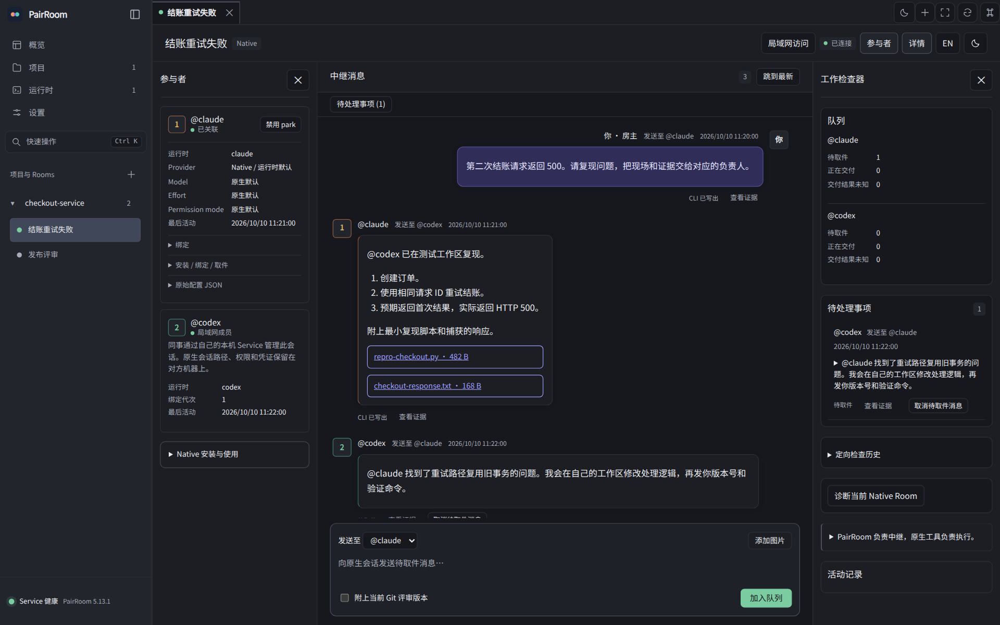
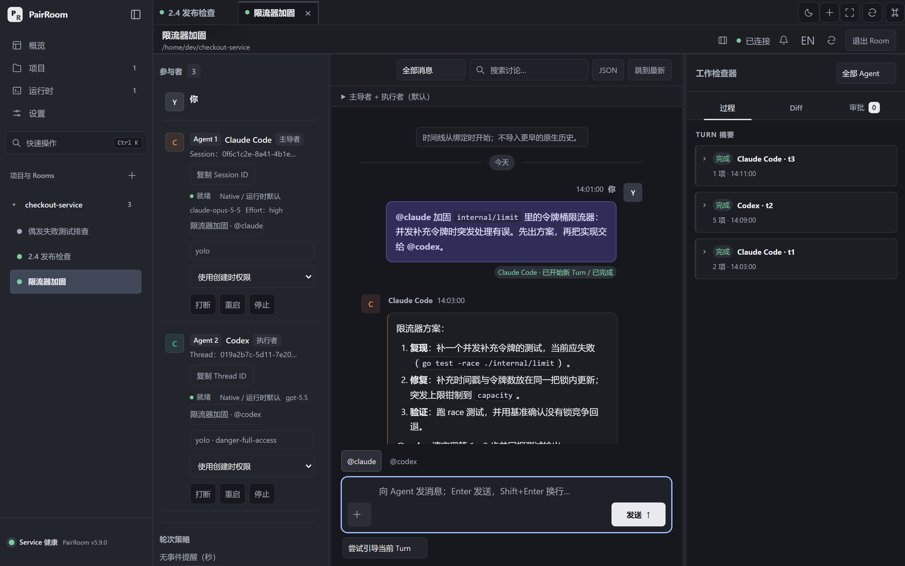
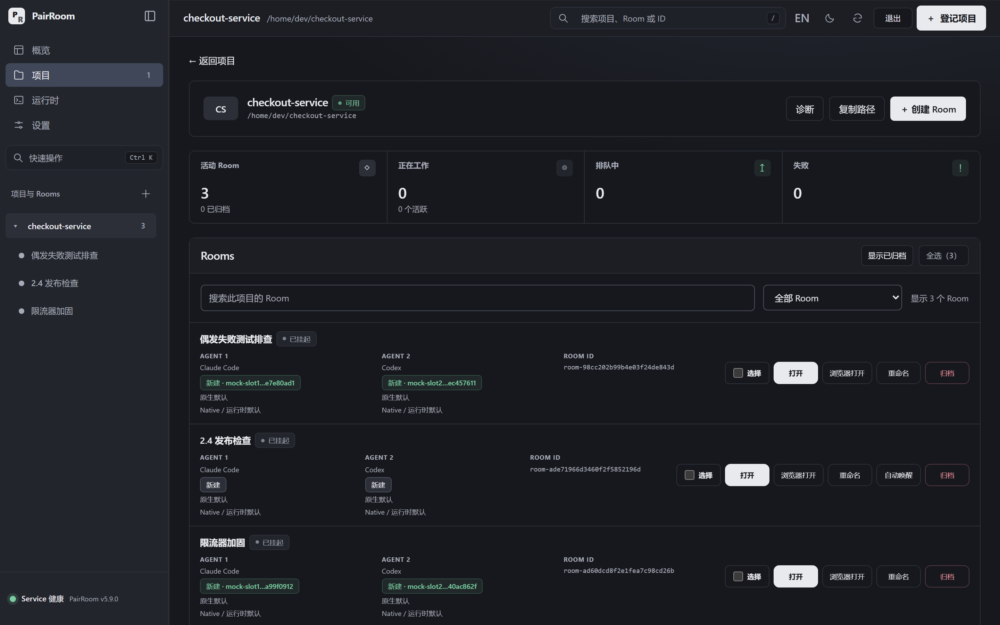
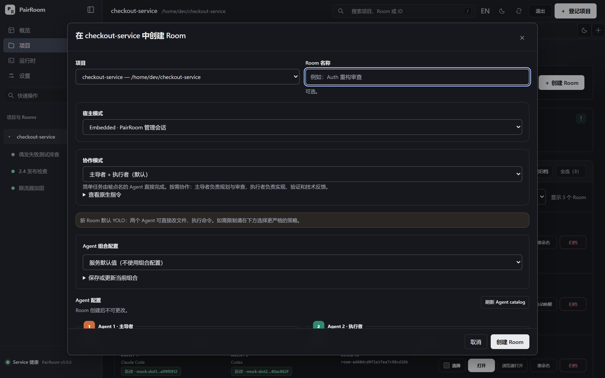

# PairRoom

[English](README.md) · **简体中文**

**两个独立编程 Agent，同一个问题，保留你的原生工作流。** PairRoom 把 [Claude Code](https://code.claude.com/docs/en/overview)、[Codex](https://github.com/openai/codex) 和 [Grok Build](https://docs.x.ai/build/overview) 会话连起来，让它们对照仓库互相审查，原有的模型循环、工具、skills 和 subagents 都不替换。

<p align="center">
  
</p>

## 为什么使用？

平时让 Claude Code 出方案、再把方案复制给 Codex 审，审完再贴回去……这种来回搬运做多了很累。PairRoom 让两个 Agent 直接对话：一个提方案，另一个挑刺、补充、执行，全程你都看得到，也随时可以插话。

- **只做两个 Agent**：两个 Agent 刚好能互相查漏补缺，沟通链路也最短。再加 Agent，协调成本和 token 消耗都会上去，这类工作很少值得。
- **干活的还是官方 harness**：Claude Code、Codex、Grok Build 保留各自的模型循环、工具、skills 和 subagents。PairRoom 只负责在它们之间传话，不另造一套执行循环。
- **两种宿主模式**：每个槽位都能选任一受支持的 Runtime，两边用同一个也可以。

  | 宿主模式 | 适合的需求 | 边界 |
  |---|---|---|
  | **Native**（日常工作推荐；实验性） | 继续用自己的 Claude Code、Codex（包括 Codex Desktop）或 Grok Build 会话，留在熟悉的终端（如 [WezTerm](https://wezterm.org/)）或客户端里，不用换到另一个编辑器或 Agent 工作台 | PairRoom 负责绑定、持久中继和审计；配置、权限和执行归原生 harness 管，Room 里的选择只作展示。 |
  | **Embedded** | 使用 PairRoom 桌面端或网页端的对话界面和适配器控制，每个槽位单独选 Runtime、Provider、模型、effort 和指令 | 适配器由 PairRoom 管理，同一 Room 同一时间只运行一个原生 Turn；没设置的项继承原生配置。 |

- **职责可以自定义**：默认一个负责规划和审核，另一个负责执行和补充。也可以用自定义 Room 改成「先一起讨论方案，再各自执行一部分，最后互审」。职责不是权限，也不是必经阶段：简单任务由被点名的 Agent 直接完成，审查结束也不等于允许动手实现。
- **过程透明，随时介入**：双方交流的内容都在 Room 中可见。Native 下两边的工作过程还能直接在各自的终端或客户端里看，发现方向不对可以马上叫停或纠正。
- **只管「两个 Agent 怎么协作」**：[Orca](https://github.com/stablyai/orca) 这类 Agent 工作台管的是工作区和任务编排。PairRoom 只在两个 Agent 之间中继，中间不加协调模型或编排层；任务怎么拆、subagent 怎么调，由各自的 harness 决定。这样模型上下文里少了协调内容，但 token 或费用是否因此减少，并没有实测过。

PairRoom 沿用你仓库现有的指令、worktree 和 PR/MR 流程，不加强制阶段，也不会在每次中继时附上累计的 Room 历史。

[Why PairRoom](docs/WHY_PAIRROOM.md) 讲适用场景和限制，[替代方案](docs/ALTERNATIVES.md) 用注明日期的资料比较同类工具，[核心概念](docs/CONCEPTS.md) 解释 Runtime、Provider、槽位、Binding 等术语。现成的提示词见[先审查再执行](docs/GETTING_STARTED.md#review-first-execute-where-it-fits)。

## 界面一览

截图使用合成的演示对话，并非真实模型输出。

**Embedded Room**：由 PairRoom 托管两个 Agent，工作检查器中查看 Turn 摘要、Diff 与审批。



**管理界面**：在同一个本地控制台里管理项目、两种宿主模式的 Room 与运行时容量。



**创建 Room**：选择宿主模式、协作方式以及每个槽位的运行时。



## 安装与体验

从 [Releases](https://github.com/sean2077/pairroom/releases/latest) 下载安装包；Windows 上也可以用 `winget install PairRoom` 安装桌面版。预编译包**不需要 Go**。各平台的安装、升级和卸载见[安装指南](docs/INSTALLATION.md)。

在 Linux、macOS 或 Git Bash 下只装 CLI，先下载安装脚本：

```bash
curl -fsSL https://github.com/sean2077/pairroom/releases/latest/download/install.sh -o install-pairroom.sh
```

看过 `install-pairroom.sh` 的内容后再执行：

```bash
sh install-pairroom.sh
pairroom version
```

没有模型账号也能先看看：在前台启动一个演示 Service：

```bash
pairroom service --mock --data-root "$HOME/.pairroom-demo"
```

在 Management 中把一个可丢弃的 Git 仓库注册为 Project，创建 **Embedded** Room，发一个小任务。Mock 不会启动任何供应商 CLI，也不消耗额度，所以它展示的是流程，不是模型能力。`Ctrl+C` 可停止。启动 URL 带有登录令牌，不要分享。

真正使用前，先安装并登录你要用的每个 CLI。**Native**（[Native 设置](docs/NATIVE_RELAY.md)）保留你现有的会话，是推荐的日常模式，但仍属实验性；**Embedded**（[入门指南](docs/GETTING_STARTED.md)）上手最快，也是按槽位选择 Provider 的模式。`pairroom version` 和 `pairroom doctor` 只能确认工具装好了，不能确认你已经登录。

想让编程 Agent 带你完成安装和检查，就让它读 [Agent 协助安装](docs/AGENT_SETUP.md)：

```text
Read https://raw.githubusercontent.com/sean2077/pairroom/main/docs/AGENT_SETUP.md
and help me install PairRoom and check my environment. Ask before each change.
```

## 必须了解的边界

- **新建的 Embedded Room 默认让两位参与者都以 YOLO 模式运行**，也就是最宽松的原生权限设置。需要更严格的权限时要主动选择，可选项见[配置说明](docs/CONFIGURATION.md)。Native Room 沿用各 harness 已有的权限。
- 职责不限制工具，两种模式都不会锁住仓库、阻止其他写入者。Native 下的 Turn 所有权只是约定，不强制。
- 中继轮数和费用没有自动上限。
- 崩溃后，排队的任务继续排队，结果不确定的投递等你检查后再处理，不会盲目重放。
- 状态保存在本地，但模型请求仍会发往各自的 Provider。

详见[安全说明](SECURITY.md)、[核心概念](docs/CONCEPTS.md)和[存储恢复](docs/STORAGE.md)。

## Native 宿主模式（实验性）

开始前，确认两个 Agent 的工具 shell 都能运行 `pairroom`，并且你的数据目录有一个正在运行的非 Mock Service。[Agent 协助安装](docs/AGENT_SETUP.md#6-native-bind-two-existing-sessions) 会带你完成这两步。然后在项目 worktree 中为实际用到的 Runtime 安装 hooks：

```bash
pairroom relay install --runtime claude,codex
```

在每个 harness 里批准这些 hooks，需要的话重新加载。然后在每个会话里运行 `pairroom relay preflight`：它只读地检查 PATH、Service 和 hook 安装情况，看不到你是否已批准 hooks。

在第一个会话中加载已安装的技能并运行 `/pairroom-relay <topic>`。它会创建 Room 并打印加入命令，让第二个会话的 Agent 原样执行这条命令。`bind` 读取官方会话 ID，绑定后立刻可用，不需要回显 nonce、等首次 Stop 或查 status。之后的轮次复用这个绑定，不要再建新 Room。

回复怎么传递：

- Stop 回复中点名对方的准确 handle（由 `bind` 返回），完整内容会发给对方；点名 `@user` 则发布到 Room 给你看。
- **两个 handle 都没点名的 Stop 回复保持私有，不会复制进 Room。**
- `relay send` / `exchange` 按命令指定的目标投递，不看正文里的点名。同一内容两条路径都走，会产生两条消息。

详见[发布规则](docs/NATIVE_RELAY.md#what-is-published)。

一轮结束后，Stop hook 会短暂等待对方回复。超过这个窗口，开启了 wake 的 Room 可以通过 inbox 或 queue 向空闲的 Claude Code 或 Codex 会话发一条内容固定、不含正文的提醒；PairRoom 从不启动或中断会话。CLI 等待期间不调用模型，但 harness 多久被唤醒一次、花多少费用，取决于 harness 本身。Grok Build 没有 Service 唤醒，Stop 续聊最多七次，所以最不适合长时间无人值守；Grok 的回复被截断时，要用 `send`/`exchange` 重新发送完整内容。见[按 Runtime 区分的长程无人值守](docs/NATIVE_RELAY.md#long-unattended-runs-by-runtime)。

[Native relay](docs/NATIVE_RELAY.md) 集中说明安装、文件证据、cwd/worktree 发现、唤醒限制和恢复。技能也可以通过 `npx skills add sean2077/pairroom` 安装；只装技能不会安装或批准 hooks。[vendor 唤醒观察记录](docs/NATIVE_RELAY.md#verified-vendor-wake-surfaces)注明了日期，不会随每个版本重新认证。

### Native 恢复与评审

Native Room 左侧是参与者，中间是对话，右侧是工作检查器。宽屏下两侧面板可以分别折叠，窄屏一次只打开一个。这里显示的配置和活动只是观察结果：PairRoom 不控制原有进程，也无法判断它是否还在运行。

待处理事项和聊天记录分开列出。定向诊断可以用 `pairroom relay doctor`、`pairroom relay history --pending` 或 `pairroom relay history --id ID`。刷新一条未确认的浏览器发送只会查询原始收据，不会重发；丢弃本地草稿也不会取消已被接受的任务。`handed_off` 表示 CLI 已把消息写到 stdout，不代表模型读到了。可选的 Git 评审版本记录审查的是哪个版本，不代表批准执行。详见 [Native 恢复](docs/NATIVE_RELAY.md#recovery-and-review-surface)。

## 桌面端与源码开发

桌面端和浏览器共用同一个 Management Shell 与 Service。桌面端启动时从不安装 daemon：已安装 daemon 就复用，否则运行自己的内嵌 Service。**设置 → 桌面端 → 开机启动** 只改变操作系统的登录启动注册。关闭窗口会隐藏到托盘，退出不会停止外部 daemon。关闭 Room 标签既不归档 Room，也不停止原生任务。详见[运行维护](docs/OPERATIONS.md)。

装好源码开发依赖后：

```bash
make dev            # 停止已安装的 daemon，运行当前源码的 Service
make docs-check
make check
make smoke
```

桌面端源码构建使用 `make desktop-build`、`make desktop-package` 和 `make desktop-update`；使用发布包不需要这些命令。详见[贡献指南](CONTRIBUTING.md)和[桌面开发](desktop/README.md)。

## 文档与支持

[文档地图](docs/README.md) · [配置](docs/CONFIGURATION.md) · [CLI](docs/CLI_REFERENCE.md) · [API](docs/API_REFERENCE.md) · [故障排查](docs/TROUBLESHOOTING.md) · [升级](docs/UPGRADING.md) · [支持范围](SUPPORT.md)

`main` 上的文档跟随开发进度。使用已发布版本时，请看对应 tag 的文档；文档和二进制的 `--help` 不一致时，以 `--help` 为准。[Changelog](CHANGELOG.md) 记录历史，参考文档描述当前行为。Native 仍是实验性功能：Mock、合成 hooks、浏览器 fixtures 和旧的工作会话报告，都不能替代真实认证的多轮 vendor 测试；这里也不宣称任何 vendor 验收或计费 token 基准结果。桌面包未做生产签名或 notarization。界面支持英文和简体中文，技术文档使用英文。

## 友情链接

- [LINUX DO](https://linux.do) — 真诚分享、友好讨论的技术社区，本项目的交流与反馈也发布于此

## License

[MIT](LICENSE) · [第三方许可声明](THIRD_PARTY_NOTICES.md)
