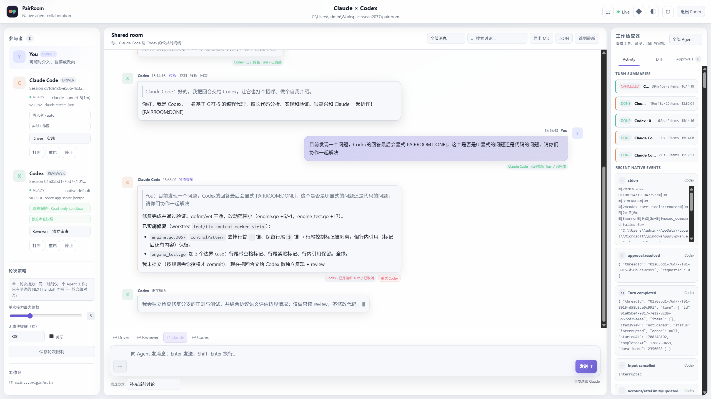

# PairRoom

[English](README.md) · **简体中文**

**两个独立编程 Agent，同一个问题，保留你的原生工作流。** PairRoom 连接受支持的 [Claude Code](https://code.claude.com/docs/en/overview)、[Codex](https://github.com/openai/codex) 与 [Grok Build](https://x.ai/news/grok-build-cli) 会话，让双方基于证据交叉审查，不替换原生模型循环、工具、skills 或 subagents。

<p align="center">
  
</p>

## 为什么使用？

平时让 Claude Code 出方案、再把方案复制给 Codex 审，审完再贴回去……这种来回搬运做多了很累。PairRoom 让两个 Agent 直接对话：一个提方案，另一个挑刺、补充、执行，全程你都看得到，也随时可以插话。

- **只做两个 Agent**：两个 Agent 刚好能互相查漏补缺，沟通链路也最短。再加 Agent，协调成本和 token 消耗都会上去，这类工作很少值得。
- **复用官方 harness，不重新造轮子**：Claude Code、Codex、Grok Build 保留各自的模型循环、工具、skills 和 subagents。PairRoom 连接这些编程环境，而不是重新实现一套执行循环。
- **两种宿主模式**：任一槽位都可选择任一受支持的 Runtime，也可同时使用相同 Runtime。

  | 宿主模式 | 适合的需求 | 边界 |
  |---|---|---|
  | **Native**（日常工作推荐；实验性） | 保留原有 Claude Code、Codex（包括 Codex Desktop）或 Grok Build 会话，继续在熟悉的终端（如 [WezTerm](https://wezterm.org/)）或客户端里交互，不用换到另一个编辑器或 Agent 工作台 | PairRoom 负责绑定、持久中继和审计；原生 harness 管理配置、权限与执行，Room 中的选择仅作展示。 |
  | **Embedded** | 使用 PairRoom 桌面端或网页端对话界面及受支持的适配器控制；每个槽位独立选择 Runtime、Provider、模型、effort 和指令 | PairRoom 管理适配器，在同一 Room 内同时只调度一位参与者的原生 Turn；未指定覆盖项继承原生配置。 |

- **职责可以自定义**：默认一个负责规划和审核，另一个负责执行和补充。也可以用自定义 Room 改成「先一起讨论方案，再各自执行一部分，最后互审」。职责不是权限，也不是必经阶段：简单任务由被指定的 Agent 直接完成，审查完成也不自动授权实现。
- **过程透明，随时介入**：双方交流的内容都在 Room 中可见。Native 下两边的工作过程还能直接在各自的终端或客户端里看，发现方向不对可以马上叫停或纠正。
- **只管「两个 Agent 怎么协作」**：[Orca](https://github.com/stablyai/orca) 这类通用 Agent 工作台定位是工作区和任务编排。Orca 是这里用于比较的独立项目，不是 PairRoom 的依赖。PairRoom 只做两个 Agent 之间的直接中继，不额外引入协调模型或编排层；每个 Agent 内部怎么拆任务、怎么调 subagent，交给它自己的原生 harness。模型需要看到的协调内容因此更少，但这是机制描述，不是实测的 token 或成本节省。

沿用仓库指令、worktree 和 PR/MR 流程。PairRoom 不增加强制阶段机制，也不会在每次中继时追加累计 Room 历史。紧凑的字节预算不等于保证账单更低或准确率更高。

[Why PairRoom](docs/WHY_PAIRROOM.md) 说明适用场景与限制，[替代方案](docs/ALTERNATIVES.md) 提供注明日期的一手资料比较，[先审查再执行](docs/GETTING_STARTED.md#review-first-execute-where-it-fits) 提供实用提示词。[核心概念](docs/CONCEPTS.md) 解释 Runtime、Provider、槽位和 Binding 等术语。

## 安装与体验

从 [Releases](https://github.com/sean2077/pairroom/releases/latest) 下载安装包；Windows 可使用 `winget install PairRoom` 安装桌面版。[安装指南](docs/INSTALLATION.md) 说明安装前提及各通道的升级、卸载方法。使用预编译 CLI 或桌面包**不需要 Go**。

Linux、macOS 或 Git Bash 下使用 CLI，先在临时工作目录中下载安装脚本：

```bash
curl -fsSL https://github.com/sean2077/pairroom/releases/latest/download/install.sh -o install-pairroom.sh
```

下载成功后，用编辑器检查 `install-pairroom.sh`，确认后再执行：

```bash
sh install-pairroom.sh
pairroom version
```

不访问模型的初次体验可启动前台演示 Service：

```bash
pairroom service --mock --data-root "$HOME/.pairroom-demo"
```

保持此终端打开，`Ctrl+C` 可停止演示。使用未被占用的演示数据目录和可丢弃的 Git 仓库。在 Management 中将仓库注册为 Project，创建 **Embedded** Room，再发送一个小任务。Mock 不启动供应商 CLI，也不消耗模型额度；它不能证明模型能力。不要分享带认证信息的启动 URL。

真实使用前，独立安装并认证每个所选 CLI。日常工作推荐使用 **Native**（[Native 设置](docs/NATIVE_RELAY.md)）保留原有会话，它仍处于实验阶段；**Embedded**（[入门指南](docs/GETTING_STARTED.md)）是最快的初次体验方式，也是每个槽位独立选择 Provider 的模式。仅有 CLI 版本或环境检查结果，不代表认证和模型访问已通过验证。

如需让你的编程 Agent 引导安装和环境检查，请让它阅读 [Agent 协助安装](docs/AGENT_SETUP.md)：

```text
Read https://raw.githubusercontent.com/sean2077/pairroom/main/docs/AGENT_SETUP.md
and help me install PairRoom and check my environment. Ask before each change.
```

## 必须了解的边界

**新 Embedded Room 的两位参与者默认均为 YOLO：这是受支持的最宽松原生权限配置，不是只读审查模式。** 需要更严格的原生权限时必须明确选择，具体见[配置说明](docs/CONFIGURATION.md)。Native Room 沿用原生 harness 的权限。职责不会限制工具访问，两种模式都不会锁住仓库来阻止外部写入；Native 的 Turn 所有权只是建议性的，不是强制调度。

PairRoom 没有自动接力次数或费用上限。持久化恢复会区分排队任务与结果不确定的投递，不会在崩溃后盲目重放。本地保存状态不代表云端模型请求不离开本机。详见[安全说明](SECURITY.md)、[核心概念](docs/CONCEPTS.md)与[存储恢复](docs/STORAGE.md)。

## Native 宿主模式（实验性）

先确保两个 Agent 的工具 shell 都能运行 `pairroom`，且所选数据目录已有一个非 Mock Service。[Agent 协助安装](docs/AGENT_SETUP.md#6-native-bind-two-existing-sessions) 说明这些前提和授权步骤。从项目 worktree 中为实际使用的 Runtime 安装 hooks：

```bash
pairroom relay install --runtime claude,codex
```

在每个 harness 中审阅并批准 hooks，按其要求重新加载或重启。在两个目标会话中分别运行 `pairroom relay preflight` 做只读检查；它不证明 hook 已获批准，也不证明模型可访问。

第一个会话加载已安装的技能，运行 `/pairroom-relay <topic>`；在第二个会话中，让 Agent 执行前者打印的准确加入命令。各自的 `bind` 读取官方会话 ID 并立即关联，不需要回显 nonce、等待首次 Stop 或例行查询 status。后续轮次复用绑定；加入现有 Room 时不要再次创建。

bind 返回的准确 peer handle 用于路由自动 Stop 回复；`@user` 将结果发布给人类。**未点名的 Native Stop 回复不会被复制进 Room。** 显式 `relay send` / `exchange` 则由命令目标决定投递，不解析正文点名。两条路径都发布可能产生两条消息。详见[发布规则](docs/NATIVE_RELAY.md#what-is-published)。

获批 Stop hook 在有界 park 窗口内收件。窗口外，开启 wake 的 Room 可通过可用 Claude inbox 或 Codex queue 发送固定、无正文的唤醒提示，不启动或中断会话。Grok 使用前台收件；只有 harness 能呈现后台完成通知时，才使用它管理的后台 wait。CLI 等待不调用模型，但唤醒、续聊与计费取决于 harness。被截断的 Grok 输出必须显式发布完整原文。Grok 没有 Service 唤醒，Stop 续聊最多七次，因此最不适合长时间无人值守的协作；见[按 Runtime 区分的长程无人值守](docs/NATIVE_RELAY.md#long-unattended-runs-by-runtime)。

[NATIVE_RELAY.md](docs/NATIVE_RELAY.md) 集中说明安装、文件证据、cwd/worktree 发现、唤醒限制和恢复。技能也可经 `npx skills add sean2077/pairroom` 分发；仅安装技能不会安装或批准 hooks。注明日期的[vendor 观察记录](docs/NATIVE_RELAY.md#verified-vendor-wake-surfaces)不等于当前版本的发布验收认证。

### Native 恢复与评审

Native Room 左侧是参与者，中间是对话，右侧是工作检查器。宽屏可独立折叠两侧面板；窄屏一次只打开一个。展示的配置与活动是观察结果，不代表控制了原有进程，也不证明实时在线。

待处理事项独立于最近聊天。使用 `pairroom relay doctor`、`pairroom relay history --pending` 或 `pairroom relay history --id ID` 定向诊断。可选 Git 评审版本标识证据，不授权执行。未确认发送在刷新后只查询原始收据，不自动重发；清除本地草稿不会取消已接受的任务。`handed_off` 仅证明 CLI 写出了 stdout，不代表模型接受。详见[Native 恢复](docs/NATIVE_RELAY.md#recovery-and-review-surface)。

## 桌面端与源码开发

桌面端与浏览器共用 Management Shell 和 Service。桌面端启动不会安装 daemon：它复用已安装的 daemon，或自行管理内嵌 Service。**设置 → 桌面端 → 开机启动** 只改变操作系统的登录启动注册。关闭窗口会隐藏到托盘，退出不会停止外部 daemon。关闭 Room 标签不会归档 Room 或停止原生任务。详见[运行维护](docs/OPERATIONS.md)。

安装源码开发依赖后可运行：

```bash
make dev            # 停止已安装的 daemon，运行当前源码的 Service
make docs-check
make check
make smoke
```

桌面源码命令为 `make desktop-build`、`make desktop-package` 和 `make desktop-update`；它们不是使用发布包的前提。详见[贡献指南](CONTRIBUTING.md)和[桌面开发](desktop/README.md)。

## 文档与支持

[文档地图](docs/README.md) · [配置](docs/CONFIGURATION.md) · [CLI](docs/CLI_REFERENCE.md) · [API](docs/API_REFERENCE.md) · [故障排查](docs/TROUBLESHOOTING.md) · [升级](docs/UPGRADING.md) · [支持范围](SUPPORT.md)

`main` 上的文档跟随开发；使用已发布版本时，如命令存在差异，应查看对应 tag 的文档及该二进制的 `--help`。[Changelog](CHANGELOG.md) 记录历史，当前行为以参考文档为准。Native 仍是实验性功能：Mock、合成 hooks、浏览器 fixtures 及旧工作会话报告，不能替代真实认证的多轮 vendor E2E。本文不宣称新增真实 vendor 验收或计费 token 基准结果。桌面包不宣称完成生产签名或 notarization。界面支持英文和简体中文，维护中的技术文档使用英文。

## 友情链接

- [LINUX DO](https://linux.do) — 真诚分享、友好讨论的技术社区，本项目的交流与反馈也发布于此

## License

[MIT](LICENSE) · [第三方许可声明](THIRD_PARTY_NOTICES.md)
